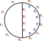

# Tutorial


We will try to use the building in the figure as an example.



The tutorial will consider two cases:

 1. Simpler building, where only the pressure was measured on the outer surface of the cylinder.
 2. The full case where there are external and internal surfaces with sections where the internal pressure is measured and other sections where it is not.

## A simple cylindrical structure

The building will be cylindrical in shape with a diameter of 30 m and 150 m high. Only external pressure taps exist. They are located along 10 rows equally distributed along the height of the building. Each row is composed of 24 pressure taps totalling 240 pressure taps on the outer surface of the building.

The geometry of th building required by `BuildingGeometry` is a set of faces composed of triangles. Each face is a vector of `BuildingGeometry.Tri`. In this case, the geometry consists of a single cylindrical surface that will be generated in Julia directly

### Defining the geometry of the building

```@setup 1
using GLMakie
using BuildingGeometry
using Colors
``` 

```@example 1

H = 150.0 # Height
D = 30.0  # Diameter
R = D/2   # Radius

θ = 0.0:15.0:360
nθ = length(θ)
x1 = R * cosd.(θ)
y1 = R * sind.(θ)

p1 = SVec.(x1, y1, 0.0)
p2 = SVec.(x1, y1, H)

trilst = [Tri(p1[1], p1[2], p2[2]), Tri(p1[1], p2[2], p2[1])]

for i in 2:nθ-1
    push!(trilst, Tri(p1[i], p1[i+1], p2[i+1]))
    push!(trilst, Tri(p1[i], p2[i+1], p2[i]))
end
```

To plot the meshes, there is the function [`tri2mesh`](@ref) that converts the vector of triangles into a the vertices and connectivity necessary for plotting in method `mesh` from `Makie`.

```@example 1

mesh(tri2mesh(trilst)...)
```


Now, the vector `trilst` contains the only face in the geometry.

### Defining the external pressure taps

We will have 10 equally spaced rows of pressure taps with 24 pressure taps per row.

```@example 1
nr = 10 # Number of rows
dz = H/nr  # Height of each row
zh = range(dz/2, step=dz, length=nr)
θ2 = range(15/2, step=15, length=24)

epts = SVec{3,Float64}[]
for z in zh
    for ang in θ2
    	x = R * cosd(ang)
	y = R * sind(ang)
	push!(epts, SVec(x, y, z))
    end
end

fig,ax,plt = mesh(tri2mesh(trilst)..., color=(:gray, 0.3));
scatter!(ax, Point.(epts), color=:red);
fig
```

### Discretizing the building

Now that we have the geometry of the building and the position of the pressure tap,
we can discretize the building into regions of influence of each pressure tap. The idea here is to split the surface into triangles with each triangle having two sides. The external side (side 1) and the internal side. Each side will reference the pressure acting on it. In the simplest case, it referes to the index of the pressure tap. Since this is actually a parametric type, it could also be an set of indices of pressure taps and respective weights to compute a weighed average. For now only the simplest case is implemented.

The discretization is done using the function [`buildsurface`](@ref). This function has two arguments:

 1. The geometry of the surface, a vector of triangles
 2. Definition pressure tap positions on different sections of the face. The first section refers to the external face of the surface. Each section is an element of a vector with a named tuple that has the coordinates of each pressure tap on the section (field `points`), the index (of the geometry defined in the first argument) that make up the section) and the id of each pressure tap.  If the `id` field is not provided, it uses the value stored in the `nointid` keyword argument. It also has a `tag` field that adds an identifying tag to the section. If not provided, it uses the defult value in keyword argument `tag`.

Default values for `tag` and `id` is provided in the `tag` and `nointid` keyword arguments.


The function returns a [`BuildingSurface`](@ref) object. This object has an array of triangles that make up the surface, an array of points specifying the coordinates of each triangle (today this is the centroid of each triangle) and an array of [`NodeInfo`](@ref) objects.

The [`NodeInfo`](@ref) objects is the most important field. It stores the influence area of each node times the outer normal. the coordinate of the node and side information as described above. This all that is needed to compute forces and moments. The `BuildingSurface` is just a helper that stores the triangles for a more easy visualization.

In this simple building, only external pressure taps exist. Therefore the internal side (`side==1`) will adopt the `nointid=-1`. There is a single section in this example.

Usually, there are several surfaces that make up the building. After discretizing each surface, they can be merged using method [`mergemeshes`](@ref). 

```@example 1
msh = buildsurface(trilst, # The geometry defined above
                   [(points=epts, # Points defined above
		     tri=1:length(trilst), # Every triangle of the geometry
		     id = 1:240)],
		  nointid = -1); # Use this value for internal pressure tap.

# Now we will try to view the region of influence of each tap
using Colors
cc = distinguishable_colors(240)  # One color for each pressure tap
ie = nodeside.(msh.nodes, 1)  # Getting the external pressure tap for each triangle
fig,ax,plt = mesh(tri2mesh(msh.tri)..., color=repeat(cc[ie],inner=3))
scatter!(ax, Point.(epts))
fig
```

### Slicing the building

An important result of wind tunnel testing is obtaining a distribution of forces. For a tall building this means forces and moments on each floor. With this in mind, the total mesh of the building must, often, be sliced so that the forces on each floor can be computed. The generic function [`buildingslice`](@ref) has several methods to slice the building. In our simple cylindrical building, we will assume that each floor is 3 m high.

```@example 1
zslices = 0.0:3.0:H  # Boundaries of each slice

slices = buildingslice(msh, zslices);

# Let's try to plot every other floor
fig,ax,plt = scatter(Point.(epts), color=:black) # Pressure taps
for i in firstindex(slices):2:lastindex(slices)
    ie1 = nodeside.(slices[i].nodes, 1)
	mesh!(ax, tri2mesh(slices[i].tri)..., color=repeat(cc[ie1],inner=3))
end
fig
```


### Computing the forces

With the building discretized into triangles and with each triangle having information on the outside and inside pressure, forces can be easily calculated with the [`NodeInfo`](@ref) obtained with [`buildsurface`](@ref) and [`buildingslice`](@ref).

Given a pressure distribution, the force acting on one side of the surface is given by

``\vec{F} = -\int_S p \:d\vec{A}``

The moment is calculated by

`` \vec{M} = -\int_S p \vec{r}\times d\vec{A} ``

Using the discretization obtained above,

``\vec{F} = -\sum_{i=1}^{N_{taps}} p_i \cdot \vec{A}_i``

``\vec{M} = -\sum_{i=1}^{N_{taps}} p_i \cdot \vec{r_i} \times \vec{A}_i``

Notice that given a vector with every pressure measurement, the operations above can be represented as a matrix multiplication.

``\left\{\begin{matrix}F_x\\F_y\\F_z\\M_x\\M_y\\_Mz\end{matrix}\right\} = \left[ F_{matrix} \right] \cdot \left\{\begin{matrix}p_1\\p_2\\p_3\\\vdots\\p_{N_{taps}}\end{matrix}\right\}``

The `` \left[F_{matrix}\right] `` matrix is sparse. The number of rows is the number of triangles (or nodes in more general cases) and the number of columns is the number of pressure taps. To compute this matrix for a discretized surface, use the [`addforcecontrib!`](@ref) method or [`forcematrix`](@ref). The `forcematrix` method allocates memory for the matrix and calls `addforcecontrib!` method. The methods are defined in this way because there might be contributions from both sides of the surface and each contribution should be added independently to result in the full force matrix.

```@example 1
# Remember we have 240 pressure taps!
Fbase = forcematrix(240, msh.nodes, (1,2,3,4,5,6); sgn=1, side=1, point=SVec(0.,0.,0.))
println("Dimensions of `Fbase`: $(size(Fbase))")
```

The first parameter is the number of columns. This is actually the number of pressure taps  used. The second parameter is the mesh. The third parameter specifies which components of the force should be calculated:

 1. ``F_x``
 2. ``F_y``
 3. ``F_z``
 4. ``M_x``
 5. ``M_y``
 6. ``M_z``

The keyword argument `sgn` multiplies each matrix element. In the case of internal pressure, usually this argument is -1. But it can also account for scaling factors or different reference wind velocity. The `side` keyword argument specifies which side of the face is contributing to a force. In a more general case, `forcematrix` would be called sith `sgn=1` and `side=1` then `addforcecontrib!` would be called with `sgn=-1` and `side=2`. Since we only have external pressure taps, in the example above, `sgn=1` and `side=1`.

The moments of each triangle is calculated with respect to the point specified by the `point` keyword argument.

The matrix above can be used to calculate the loads on the foundation of the building.


### Calculating the forces on each slice

Usually the structure designer wants a load distribution. For instance on a tall building, the finite element software usually requires the loads on each floor. There are other methods for [`addforcecontrib!`](@ref) and [`forcematrix`](@ref) for dealing with multiple meshes simultaneously.

In this case, the force matrix, when applied to the pressure measurements calculates the forces on each mesh. The `interleaved` keyword argument specifies how the forces are numbered in sequence:

 * `interleaved=false`: the each component of the force is numbered in sequence. For example if the argument `forces=(1,2,6)` the order of the forces is ``F_{x,1}``, ``F_{x,2}``, ``\ldots``, ``F_{x,N}``, ``F_{y,1}``, ``F_{y,2}``, ``\ldots``, ``F_{y,N}``, ``M_{z,1}``, ``M_{z,1}``, ``\ldots``, ``M_{z,N}`` where ``N`` is the number of floors.
 * `interleaved=false`: The forces are numbered per floor (or mesh), ``F_{x,1}``, ``F_{y,1}``, ``M_{z,1}``, ``F_{x,2}``, ``F_{y,2}``, ``M_{z,2}``, ``\ldots``, ``F_{x,N}``, ``F_{y,N}``, ``M_{z,N}``.


```@example 1
sl_nodes = [sl.nodes for sl in slices]
Fslices = forcematrix(240, sl_nodes, (1,2,6); sgn=1, side=1, point=SVec.(0.,0.,0.))
println("Dimensions of `Fslices`: $(size(Fslices))")
```


## A more complex building


This new building has all the percs shown in the original figure. It has an internal division dividing the cylinder in two halves. One halve is isolated and therefore there are not internal pressure taps (as was the case in the simple building above). But the other half has both external pressure taps and internal pressure taps.


This model has two surfaces:
 1. The cylindrical surface with external pressure taps all over (the same as the simple building above). This surface has two sections:
    * One section (half of the cylinder) has both internal and external pressure taps.
    * The second section, the other half has only external pressure taps
 2. The flat surface in that splits the cylinder in half with pressure taps on one side only (we will call this side the exterior).

### Defining the geometry

We will start out with the original geometry of the cicrcular building.

```@setup 2
using GLMakie
using BuildingGeometry
``` 

```@example 2
H = 150.0 # Height
D = 30.0  # Diameter
R = D/2   # Radius

θ = 0.0:15.0:360
nθ = length(θ)
x1 = R * cosd.(θ)
y1 = R * sind.(θ)

p1 = SVec.(x1, y1, 0.0)
p2 = SVec.(x1, y1, H)

face1 = [Tri(p1[1], p1[2], p2[2]), Tri(p1[1], p2[2], p2[1])]

for i in 2:nθ-1
    push!(face1, Tri(p1[i], p1[i+1], p2[i+1]))
    push!(face1, Tri(p1[i], p2[i+1], p2[i]))
end


pf1 = SVec(R, 0., 0.)
pf2 = SVec(-R, 0., 0.)
pf3 = SVec(-R, 0., H)
pf4 = SVec(R, 0., H)
face2 = [Tri(pf1, pf2, pf3), Tri(pf1, pf3, pf4)]
```

### Defining the external and internal pressure taps

The external pressure taps are the same as the simple building. But now we need to add internal pressure taps and external pressure taps on the second face.


```@example 2
nr = 10 # Number of rows
dz = H/nr  # Height of each row
zh = range(dz/2, step=dz, length=nr)
θ2 = range(15/2, step=15, length=24)

epts1 = SVec{3,Float64}[]

for z in zh
    for ang in θ2
    	x = R * cosd(ang)
	y = R * sind(ang)
	push!(epts1, SVec(x, y, z))
    end
end

# Internal nodes of face 1
nri = 3
dzi = H / nri
zhi = range(dzi/2, step=dzi, length=nri)
θi = range(15.0, step=30, length=6)
ipts1  = SVec{3,Float64}[]

for z in zhi
    for ang in θi
    	x = R * cosd(ang)
	y = R * sind(ang)
	push!(ipts1, SVec(x, y, z))
    end
end


# External nodes of face 2

nx2 = 3
dx2 = D/nx2
x2 = range(-R+dx2/2, step=dx2, length=nx2)
epts2 = SVec{3,Float64}[]

for z in zhi
    for x in x2
    	push!(epts2, SVec(x, 0.0, z))
    end
end


fig,ax,plt = scatter(Point.(epts1), color=:red)
scatter!(ax, Point.(ipts1), color=:blue)
scatter!(ax, Point.(epts2), color=:blue)

mesh!(ax, tri2mesh(face1)..., color=(:gray, 0.3));
mesh!(ax, tri2mesh(face2)..., color=(:gray, 0.3));
fig
```

### Discretizing the building

Now we will discretize the surfaces of the building. This case is more complicated than the simple building above. In this case, we have to surfaces. The cylindrical outer surface and the internal subdivision. But there is another complication. On the cylindrical outer surface, one section has pressure taps and on the other there is no pressure tap so this surface should decomposed into 2 sections.

There are other issues that should be taken into account. The strucutre designer wants the loads per floor but loads on the open section of the outer surface with internal and external pressure taps. To be able to handle these different faces and sections, the [`NodeInfo`](@ref) has a `tag` fields that can associate an `Int` tag on the external side and on the internal side. So we will decompose the surface as follows

 1. `face1` with 240 external pressure taps, external tag = 1
    1. Section with 18 internal pressure taps - internal tag = 2
    2. Section without internal pressure taps - internal tag = 0
 2. `face2` with 9 external pressure taps and no internal pressure taps, external tag = 3, internal tag = 0 (repeat for face1 section 2)

The nodes will be numbered sequentially:

 1. External taps on the cylindrical surface (1-240), coordinates `epts1`
 2. External taps on the internal straight plane (241-249), coordinates `epts2`
 3. Internal taps on one half of the cylindrical external surface (250-267)
 
The cylinder surface is characterized by the triangles in `face1` array. The first half (1-24) is the section with internal pressure taps. The triangles 25-48 make up the section without internal pressure taps.


```@example 2

# Let's discretize the cylindrical surface
msh1 = buildsurface(face1, # We are working on the first surface
       		    [(points=epts1, tri=1:48, id=1:240, tag=1), # Ext. surf
		     (points=ipts1, tri=1:24, id=250:267, tag=2), # Int surf. with int. pressure taps
		     (tri=25:48, id=-1)]) # Int. surf. without taps

# This call uses the `tag=0` and `nointid=-1` keyword arguments for internal  surface
msh2 = buildsurface(face2, [(points=epts2, tri=1:2, id=241:249, tag=3)],
       			      nointid=-1, tag=0)

# We could have done this instead
#msh2 = buildsurface(face2, [(points=epts2, tri=1:2, id=241:249, tag=3),
#      			     (tri=1:2, id=-1, tag=0)])

# Merging the meshes

msh = mergemeshes(msh1, msh2)
```


Let's view the some of the faces:

```@example 2
itags = nodetag.(msh.nodes, 2) # Internal tags

# We will first visualize the faces with no
# internal pressure taps
idx1 = itags .== 0

# Now let's checkout the faces with internal pressure taps
idx2 = .! idx1

# Lets view them:

let
	fig = Figure()
	ax1 = Axis3(fig[1,1], aspect=:data, title="No internal taps")
	mesh!(ax1, tri2mesh(msh.tri[idx1])...)

	ax2 = Axis3(fig[1,2], aspect=:data, title="Internal taps")
	mesh!(tri2mesh(msh.tri[idx2])...)
	fig
end
```


### Forces

This the same same as before. Just build the force matrix. With the tags,
you can also better locate the regions that you want the forces to be calculated.
In this case we should also add the internal faces contributions


```@example 2
# Remember we have 267 pressure taps!
Fbase = forcematrix(267, msh.nodes, (1,2,3,4,5,6); sgn=1, side=1, point=SVec(0.,0.,0.))

# Adding internal contribution
ii = nodetag.(msh.nodes, 2) .== 2 # Selecionando os nós com tag interna 2
addforcecontrib!(Fbase, msh.nodes[ii], (1,2,3,4,5,6); sgn=-1, side=2, 
	point=SVec(0.,0.,0.))

println("Dimensions of `Fbase`: $(size(Fbase))")
```

## Visualizing results

The [`Makie`](https://docs.makie.org/stable/) is a very powerful package for viewing data. 

As an example, let's try to plot on the mesh the function

``f(x,y,z) = z \cdot \left[(R + x)^2 + 2(R+y)^2\right]``

```@example 2

function fun(p,R)
   x,y,z = p
   return z * ((R+x)^2 + 2*(R+y)^2)
end

u = fun.(msh.points, R)
smsh = tri2mesh(msh.tri)

mesh(smsh..., color=repeat(u,inner=3))
```


### [`WriteVTK.jl`](https://github.com/jipolanco/WriteVTK.jl)


The package [`WriteVTK.jl`](https://github.com/jipolanco/WriteVTK.jl) can be used to export data into VTK file format. With VTK data files, the results can be visualized with tools such as [Paraview](https://www.paraview.org/) or [VisIt](https://visit-dav.github.io/visit-website/index.html).

